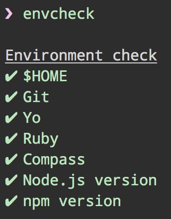

# envcheck

> [Yeoman](http://yeoman.io) environment checker

Makes sure you have the dependencies you'll usually need when using Yeoman.




## Install

```
$ npm install --global envcheck
```


## Usage

```
$ envcheck
```


## License

MIT © [Sindre Sorhus](https://sindresorhus.com)
